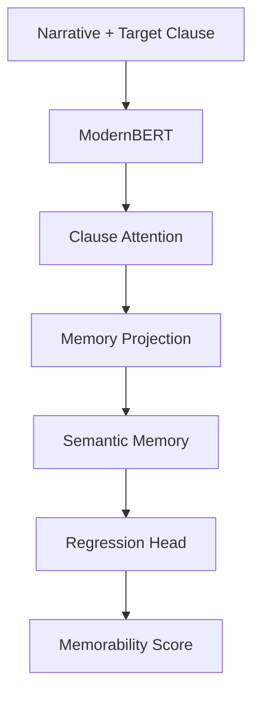
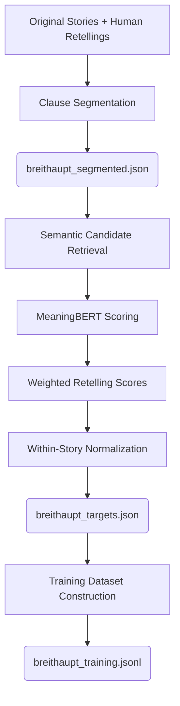
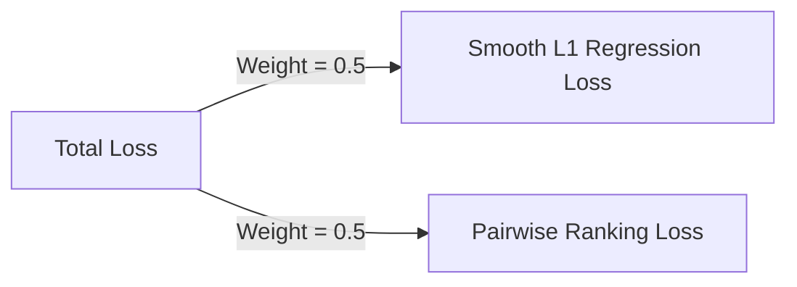
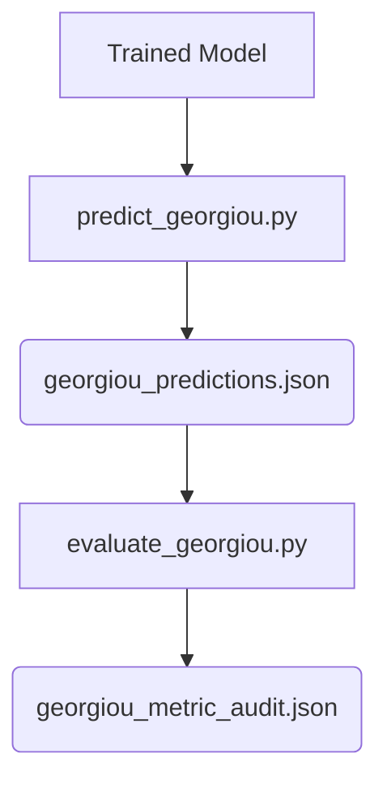

# Memorability Ranker

[](https://python.org)
[](https://opensource.org/licenses/MIT)

A neural architecture for clause-level memorability prediction from narrative context. 

Memorability Ranker estimates the memorability of an individual clause using contextual representations from **ModernBERT**, enhanced with Clause Attention, Memory Projection, and a learnable Semantic Memory Module. The model is trained on clause-level memorability targets constructed from narrative retellings and evaluated on an independent human-memorability benchmark.

---

## Table of Contents
- [Memorability Ranker](#memorability-ranker)
  - [Table of Contents](#table-of-contents)
  - [Motivation](#motivation)
  - [Model Architecture](#model-architecture)
    - [Components](#components)
  - [Training Data \& Target Construction](#training-data--target-construction)
    - [Target Construction Steps](#target-construction-steps)
    - [Dataset Format](#dataset-format)
  - [Training Configuration](#training-configuration)
    - [Loss Function](#loss-function)
  - [Evaluation \& Results](#evaluation--results)
    - [Pipeline](#pipeline)
    - [Metrics](#metrics)
  - [Repository Structure](#repository-structure)
  - [Installation](#installation)
  - [Usage](#usage)
    - [1. Generate Memorability Targets](#1-generate-memorability-targets)
    - [2. Prepare Training Data](#2-prepare-training-data)
    - [3. Train the Model](#3-train-the-model)
    - [4. Generate Evaluation Predictions](#4-generate-evaluation-predictions)
    - [5. Evaluate Predictions](#5-evaluate-predictions)
  - [Reproducibility \& Limitations](#reproducibility--limitations)
    - [Reproducibility](#reproducibility)
    - [Limitations](#limitations)

---

## Motivation

Not all information within a narrative is equally memorable. Different clauses can vary substantially in how likely they are to be recalled. This project explores whether a neural architecture can learn these differences directly from narrative context and produce a continuous memorability score for individual clauses.

**Potential applications include:**
- Educational content analysis
- Memorability-aware text processing
- Flashcard prioritization
- Narrative analysis
- Information saliency estimation
- Human-centered NLP systems

---

## Model Architecture

The architecture takes a narrative context and a target clause, processing them through a sequence of modules to output a continuous memorability score.



### Components

| Module | Purpose |
| :--- | :--- |
| **ModernBERT** | Encodes the paired narrative and target clause into contextual token representations. During training, the backbone is mostly frozen, with the final two transformer layers and final LayerNorm unfrozen. |
| **Clause Attention** | Learns a scalar attention score for each token and uses the target-clause mask to produce a weighted representation of the target clause. |
| **Memory Projection**| Transforms the 768-dimensional clause representation through a 768 → 512 → 256 MLP with GELU activation and dropout before passing it to the Semantic Memory Module. |
| **Semantic Memory** | Retrieves information from 4 heads of learned memory slots (16 slots per head) using scaled dot-product attention, then combines the retrieved representation with the input through a learned sigmoid gate. |
| **Regression Head** | Produces a continuous memorability score between 0 and 1. |

*Note: The current model uses a 256-dimensional memory representation, with 4 attention heads and 16 memory slots per head.*

---

## Training Data & Target Construction

The training pipeline uses the Breithaupt narrative and retelling data. Only the human retellings are used for target construction. Human retellings are used only to construct the memorability targets. The Memorability Ranker itself is trained using the original narrative, the target clause, and its constructed memorability score.



### Target Construction Steps

For each original clause:
1. Original and human-retelling clauses are encoded using a 384-dimensional sentence embedding model (`sentence-transformers/all-MiniLM-L6-v2`).
2. The top 5 semantic candidates are retrieved from each human retelling.
3. Candidate matches are scored using `davebulaval/MeaningBERT`.
4. The strongest candidate from each retelling is selected.
5. The three retelling scores are combined using weights of **0.2, 0.3, and 0.5**.
6. Scores are normalized within each story using percentile ranking.

### Dataset Format

Each processed training example follows this JSONL structure:

```json
{
    "narrative_id": 1,
    "paragraph": "... complete narrative ...",
    "target_clause": "... target clause ...",
    "memorability": 0.73
}
```

---

## Training Configuration

Training is performed using a story-level train/validation split so that clauses from the same narrative do not appear in both sets. A fixed random seed of `42` is used for initialization and splitting.

| Parameter | Value |
| :--- | :--- |
| Stories | 116 (92 Train / 24 Val) |
| Examples | 1,745 Train / 465 Val |
| Batch size | 8 |
| Maximum epochs | 50 |
| Learning rate | 1e-4 |
| Weight decay | 1e-2 |
| Backbone | ModernBERT-base |
| Unfrozen backbone layers | 2 |

### Loss Function

Training uses a combination of regression and pairwise ranking objectives. The ranking component compares clauses within the same narrative and ignores pairs with identical target scores.



---

## Evaluation & Results

The model is evaluated on a held-out human-memorability benchmark containing **9 stories** and **413 clauses**. These stories are separate from the 116 stories used for training and validation.

### Pipeline



### Metrics 

*Pairwise accuracy is calculated within each story. NDCG and Top-5 overlap are calculated per story and macro-averaged across the benchmark.*

| Metric | Score |
| :--- | :--- |
| Mean Absolute Error (MAE) | 0.2317 |
| Root Mean Squared Error (RMSE) | 0.2934 |
| Spearman ρ | 0.2729 |
| Kendall τ | 0.1833 |
| Pairwise Accuracy | 0.5549 |
| NDCG@1 | 0.6901 |
| NDCG@3 | 0.7149 |
| NDCG@5 | 0.7086 |
| Top-5 Overlap | 0.4444 |

---

## Repository Structure

```text
Semantic-Memorability-Ranker/
│
├── data/
│   ├── raw/
│   │   └── human_memorability_dataset.jsonl
│   └── processed/
│       ├── breithaupt_segmented.json
│       ├── breithaupt_targets.json
│       └── breithaupt_training.jsonl
│
├── dataset/
│   ├── __init__.py
│   ├── dataset.py
│   ├── generate_breithaupt_targets.py
│   ├── prepare_breithaupt_training.py
│   └── tokenizer.py
│
├── models/
│   ├── __init__.py
│   ├── clause_attention.py
│   ├── memorability_ranker.py
│   ├── memory_projection.py
│   ├── modernbert.py
│   └── semantic_memory.py
│
├── trainer/
│   ├── __init__.py
│   ├── collate.py
│   ├── losses.py
│   ├── metrics.py
│   └── trainer.py
│
├── evaluation/
│   ├── __init__.py
│   ├── evaluate_georgiou.py
│   ├── georgiou_dataset.py
│   ├── georgiou_metric_audit.json
│   ├── georgiou_predictions.json
│   └── predict_georgiou.py
│
├── train.py
├── pyproject.toml
├── README.md
└── uv.lock
```

---

## Installation

The project uses [`uv`](https://github.com/astral-sh/uv) for environment and dependency management. 

**Requirements:**
- Python >= 3.11, < 3.12

**Setup:**
```bash
git clone [https://github.com/VasishtGit/Semantic-Memorability-Ranker.git](https://github.com/VasishtGit/Semantic-Memorability-Ranker.git)
cd Semantic-Memorability-Ranker
uv sync
```

---

## Usage

### 1. Generate Memorability Targets
```bash
uv run python dataset/generate_breithaupt_targets.py
```
*Output: `data/processed/breithaupt_targets.json`*

### 2. Prepare Training Data
```bash
uv run python dataset/prepare_breithaupt_training.py
```
*Output: `data/processed/breithaupt_training.jsonl`*

### 3. Train the Model
```bash
uv run python train.py
```
*The best model checkpoint is saved under: `checkpoints/best.pt`*

### 4. Generate Evaluation Predictions
```bash
uv run python evaluation/predict_georgiou.py
```
*Output: `evaluation/georgiou_predictions.json`*

### 5. Evaluate Predictions
```bash
uv run python evaluation/evaluate_georgiou.py
```
*Output: `evaluation/georgiou_metric_audit.json`*

---

## Reproducibility & Limitations

### Reproducibility

The repository includes the code, processed data, configuration, evaluation pipeline, predictions, and metric audit used to produce the reported results.

- Processed Breithaupt data and target-generation code
- Training-data preparation code, configuration, and model implementation
- Complete evaluation pipeline, predictions, and metric logs
- Strict story-level train/validation splitting and a fixed random seed (`42`) to reduce the risk of data leakage

### Limitations
- The independent evaluation benchmark is relatively small (9 stories, 413 clauses).
- Training memorability targets are proxies, constructed from semantic alignment between original clauses and human retellings.
- Memorability is modeled strictly in the context of the surrounding narrative rather than as an isolated clause property.
- The pipeline's reliance on specific pre-trained models (`all-MiniLM-L6-v2` and `MeaningBERT`) biases the target scores.
- Prediction performance can vary across individual narratives. 
